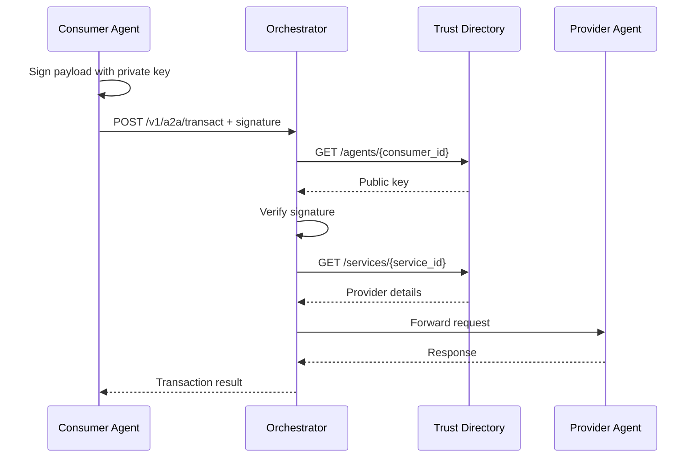

# Amorce Agent Transaction Protocol (AATP) v1.0

This document defines the AATP specification for secure agent-to-agent communication.

---

## Overview

AATP is a protocol for enabling AI agents to transact securely using cryptographic signatures and a global trust directory.

**Design Goals:**
- Zero-trust security model
- Language and framework agnostic
- Human-in-the-loop capability
- Simple integration (< 15 minutes)

---

## Protocol Layers

### L1: API Key Authentication

Optional orchestrator-level authentication.

```http
POST /v1/a2a/transact
X-API-Key: sk-atp-your-orchestrator-key
```

- **Standalone Mode**: API key optional
- **Cloud Mode**: API key required

### L2: Cryptographic Signatures (Core Security)

Every transaction payload is signed with Ed25519.

```http
POST /v1/a2a/transact
X-Agent-Signature: <base64-encoded-signature>
Content-Type: application/json

{
  "consumer_agent_id": "agent-001",
  "service_id": "srv-greet",
  "payload": {...}
}
```

**Signature Process:**
1. Consumer serializes payload to canonical JSON (RFC 8785)
2. Consumer signs with Ed25519 private key
3. Signature sent in `X-Agent-Signature` header
4. Orchestrator fetches public key from registry
5. Orchestrator verifies signature
6. Request routed only if signature valid

### L3: Rate Limiting

Per-agent request limits:
- **Standalone**: Disabled (development)
- **Cloud**: Redis-backed (default: 20 req/min)

---

## Message Formats

### Transaction Request

```json
{
  "consumer_agent_id": "string (required)",
  "service_id": "string (required)",
  "payload": "object (required)",
  "transaction_id": "string (optional)"
}
```

### Transaction Response

```json
{
  "transaction_id": "string",
  "status": "success | error",
  "timestamp": "ISO 8601 string",
  "result": "object (on success)",
  "error": "string (on failure)"
}
```

---

## Signature Specification

### Algorithm
- **Type**: Ed25519 (EdDSA)
- **Key Size**: 256 bits
- **Encoding**: Base64

### Canonical JSON
Payload must be serialized to canonical JSON per RFC 8785:
- Keys sorted alphabetically
- No extra whitespace
- Unicode escaping normalized

```python
import json

# Canonical serialization
canonical = json.dumps(payload, separators=(',', ':'), sort_keys=True)
```

### Signing Process

```python
from cryptography.hazmat.primitives.asymmetric import ed25519
import base64

# 1. Serialize payload canonically
canonical_payload = json.dumps(payload, separators=(',', ':'), sort_keys=True)

# 2. Sign
signature_bytes = private_key.sign(canonical_payload.encode('utf-8'))

# 3. Encode for transmission
signature_b64 = base64.b64encode(signature_bytes).decode('utf-8')
```

### Verification

```python
from cryptography.hazmat.primitives.asymmetric import ed25519
import base64

# 1. Decode signature
signature_bytes = base64.b64decode(signature_b64)

# 2. Serialize payload canonically
canonical_payload = json.dumps(payload, separators=(',', ':'), sort_keys=True)

# 3. Verify
try:
    public_key.verify(signature_bytes, canonical_payload.encode('utf-8'))
    return True
except:
    return False
```

---

## Registry Integration

### Agent Lookup

Orchestrator fetches agent details from registry:

```http
GET /agents/{agent_id}
```

**Response:**
```json
{
  "agent_id": "agent-001",
  "public_key": "-----BEGIN PUBLIC KEY-----\n...",
  "metadata": {
    "name": "Agent Name",
    "api_endpoint": "https://api.example.com",
    "status": "active"
  }
}
```

### Service Discovery

```http
GET /services/{service_id}
```

**Response:**
```json
{
  "service_id": "srv-001",
  "provider_agent_id": "agent-001",
  "metadata": {
    "service_path_template": "/greet",
    "method": "POST"
  }
}
```

---

## Human-in-the-Loop (HITL)

Optional approval flow for sensitive transactions.

### Approval Request

```json
{
  "approval_id": "apr_123",
  "transaction_id": "tx_456",
  "summary": "Human-readable summary",
  "details": {...},
  "timeout_seconds": 300
}
```

### Approval States

```
pending → approved | rejected | expired
```

- **pending**: Awaiting human decision
- **approved**: Human approved, proceed
- **rejected**: Human rejected, abort
- **expired**: Timeout reached, abort

---

## Error Codes

| Code | Description |
|------|-------------|
| 400 | Invalid request format |
| 401 | Invalid signature or API key |
| 404 | Agent or service not found |
| 429 | Rate limit exceeded |
| 500 | Internal orchestrator error |
| 502 | Provider agent unreachable |
| 504 | Provider agent timeout |

---

## Security Considerations

### Replay Attacks
Include `transaction_id` and timestamp in signature:

```json
{
  "consumer_agent_id": "agent-001",
  "service_id": "srv-001",
  "payload": {...},
  "transaction_id": "tx_crypto_random_uuid",
  "timestamp": "2025-12-05T17:00:00Z"
}
```

### Key Rotation
Agents should support key rotation:
1. Generate new keypair
2. Update registry with new public key
3. Gradual transition period
4. Deprecate old key

### Network Security
- Use HTTPS/TLS in production
- Validate SSL certificates
- Implement connection timeouts

---

## Versioning

AATP follows semantic versioning:

**Current Version**: 1.0.0

**Header:**
```http
X-AATP-Version: 1.0
```

Future versions maintain backward compatibility within major version.

---

## Extension Points

### Custom Headers

Agents may accept custom headers prefixed with `X-Agent-`:

```http
X-Agent-Custom: value
```

### Metadata Fields

Registry metadata is extensible:

```json
{
  "metadata": {
    "name": "required",
    "custom_field": "optional"
  }
}
```

---

## Example Flow



---

## References

- [Ed25519 Specification](https://ed25519.cr.yp.to/)
- [RFC 8785: Canonical JSON](https://www.rfc-editor.org/rfc/rfc8785)
- [Amorce Python SDK](https://github.com/trebortGolin/amorce_py_sdk)
- [Amorce JavaScript SDK](https://github.com/trebortGolin/amorce-js-sdk)

---

**Protocol Version**: 1.0.0  
**Last Updated**: December 2025  
**Maintained by**: Amorce Team
